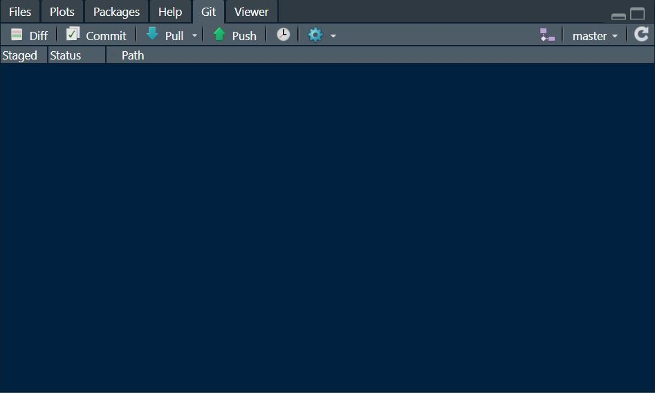

## Hi there 👋

## ~~ Some general description ~~

## GitHub workflow
*Step-by-step picture guide from RStudio*

 <i> In the present figure, each number corresponds to a step below. In a few words: work in your own branch, then do a pull request to main when you want your edits to be merged. <b> When changes are made to the main, and you already have your branch, go directly to Step 6. </b> </i> 

### First-time set up
For a first-time set up, create a new Rproject, then click on "Version Control"

Select "Git" and paste the repository URL in the corresponding box, you can get it from the green "Clone or download button" above. Give it a name (usually the name of the repository), and select where you want it to be downloaded.

Click on "Create Project", Git will download everything in your folder, and you're good to go!

### 1. Are you in the right Rproject?
You R project file should be the tropical-functional-diversity.Rproj from the main repository folder. If you have any doubt, just close R studio, double click on this file.

### 2. Are you in your own branch?
Now that you are in the project, you need to create your own branch. A branch is an environment where are contained any changes you make to the repository (i.e. it will not affect the main branch, which only contains safe, hopefully flawless code. To create your branch from Rstudio, click on the Git tab of the box (usually) in the top right-hand corner of your Rstudio.

Here you **don't want** to see 'main' or 'master', because it means that you are in the main branch, not in your own branch. If you already have your branch, just click on 'main' or 'master' then on your branch name. If you do not already have your branch, click on the icon circled in red below, enter your branch name (usually your name), then click on "Create". 

If you see your branch name in the git tab, you can start working!

### 3. Before you start working 
Make sure you're in the right Rproject and in your own branch, and that your are in sync with the main branch (see Step 6 below).

### 4. After you're done working
This is where you want to be careful, otherwise your relationship with git will most likely crumble. You have three steps to follow: stage, commit, push. When you stage, you select which files that you have modified will be uploaded to the online copy of your branch. When you commit, you combine these modifications with a message (basically what you did). When you push, you update the online version of your branch, saving all changes. This is why you should always make sure you are always inside your branch (see Step 2), because you might bring unwanted changes to the main repository.
#### Staging
In the git tab of RStudio, you will see listed any file where you have made changes. Simply select the files by clicking on the square box. When the box is ticked, the corresponding file will be considered for commit. After staging, click on commit, and a window will open.

#### Committing
In the new window, enter what changes you made in the "Commit message" box. Your staged files are shown on the left-hand side of the screen. Then click on "Commit"

#### Pushing
Click on the green upward arrow, a window will open and will not directly tell you that the push was successful. Instead you will get something like that. 

Don't worry, if you don't get an error or a abort message, everything went well!

### 5. When you want your code to be integrated in the main branch
When you think your code should be merged with the main branch, go on the GitHub page for the repository (right here). Select your branch in the Branch drop-down menu, then click on "New pull request".

In the page that opens, include a brief description of your edits to the code. Then click on "Create pull request"

One of the repository admin will check the code, and merge it with the main branch.

### 6. Updates from the main branch
When the main branch will be updated, you will get an email notification, make sure to update your branch. This will be the only interaction with the git shell, since this kind of action cannot be performed directly on RStudio. Don't worry, it looks scary, but it doesn't bite!
Click on the gear icon of your git tab, then click on "Shell..."

The shell will open in a new window. Again, make sure you see your branch name after the local address of the repository. First, type `git fetch` and hit 'enter'. This will fetch any changes made in other branches, basically updating your computer with what has been happening in the remote branches. Then, type `git merge origin/main` and hit 'enter'. This line asks git to merge any change in the origin/main with your local repository. 
This procedure ensures that, if you have made any changes to your local branch, nothing will get erased. 

 <i> NB: any changes you have made in your branch need to be committed before merging 
 </i> 

 <i> If you see `bash: git: command not found` after hitting 'enter', please look below 
 </i>

After merging from origin/main, you may see a message that tells you that your local branch is ahead of your origin branch by a number of commits. That is OK, it just means that your local branch has commits that are not in the origin branch, simply because the merge you just performed only concerns your local branch. Just hit the push button and your origin branch will updated. In addition, merge conflicts may arise if the same code that you are working on has been edited in the main. In which case, either the current GitHub manager or yourself will solve the conflict by hand.

#### If you see `bash: git: command not found` after you hit 'enter'
This issue is due to the default Windows parameters of git restricting use of git commands exclusively within git bash (the original git shell). What you need to do is simply [download git again](https://git-scm.com/download/win), and start the installer (you don't even need to uninstall git befoehand!). Just click on "Next >" until the fourth panel, and select "__Git from the command line and also from 3rd-party software__". Then click on "Next >" until the installation starts. This is the only default parameter you need to change.

Restart RStudio, and the command should work!

